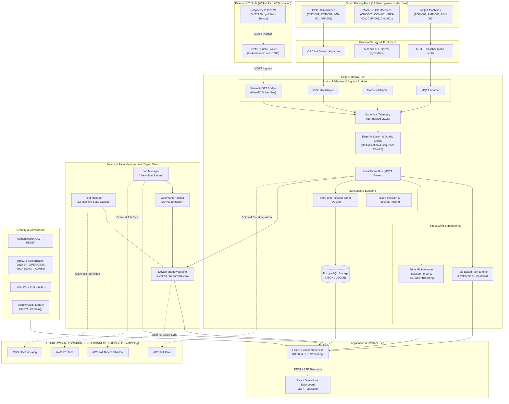

# Smart Factory Machine Monitoring and Predictive Maintenance System

A professional, end-to-end Industrial Internet of Things (IIoT) smart-factory simulation and predictive maintenance platform. The system features 12 heterogeneous industrial machines, multi-protocol communication (Modbus TCP, OPC UA, MQTT), edge gateway ingestion, local storage and processing, operational dashboards, state/fleet management, and machine learning inference for anomaly detection and Remaining Useful Life (RUL) prediction.

> [!NOTE]
> **Educational & Engineering Simulation Disclaimer**: This repository is an educational engineering simulation and software architecture demonstration project. It is **not** a safety-critical real-world industrial machine control system.

---

## High-Level System Architecture

The project employs a **Local-First, Cloud-Optional Hybrid Architecture**. The system operates fully offline using local services. The system is designed for optional future synchronization with AWS IoT Core.



### Architecture Notes

- **Local-first operation**: The entire system operates fully offline without active AWS infrastructure or external network dependencies.
- **Protocol abstraction**: Decouples heterogeneous machine simulators from industrial protocol servers (Modbus TCP, OPC UA, MQTT) and canonical edge ingestion pipelines.
- **ML integration**: Real-time unsupervised anomaly detection (Isolation Forest) and Remaining Useful Life estimation (HistGradientBoosting) with strict anti-leakage boundaries.
- **Device management**: Local digital twin device shadows (desired/reported state reconciliation), fleet catalog, and job lifecycle execution with retries.
- **Security and resilience**: Zero-trust security (local X.509 PKI/mTLS, JWT auth, 4-tier RBAC, audit logging) combined with durable store-and-forward SQLite buffering, with zero event loss and duplicate-free replay verified in controlled local outage/recovery tests.
- **AWS is currently NOT CONNECTED**: AWS IoT Core, Device Shadow, Jobs, and Fleet Indexing exist strictly as scaffolding and future adapters only.

---

## Candidate Implementation Technologies

> [!NOTE]
> **Validation Notice**: The libraries, frameworks, and tools listed below represent **candidate implementation technologies** subject to prototyping and empirical validation during future development phases, rather than permanently frozen architectural choices.

- **Simulation & Edge (Candidate Stack)**: Python 3.11+, PyModbus, asyncua, Eclipse Paho MQTT, ONNX Runtime.
- **Message Bus & Storage (Candidate Stack)**: Eclipse Mosquitto (MQTT), PostgreSQL / TimescaleDB, SQLite.
- **Backend API (Candidate Stack)**: FastAPI, Uvicorn, Pydantic, SQLAlchemy.
- **Frontend Dashboard (Candidate Stack)**: React, Vite, Vanilla CSS / Tailwind CSS, Recharts / Canvas.
- **Machine Learning (Candidate Stack)**: Scikit-Learn, XGBoost, PyTorch / ONNX Runtime.
- **Cloud (Optional Candidate Services)**: AWS IoT Core, AWS DynamoDB, AWS Lambda, AWS CloudWatch.

---

## Factory Layout & Supported Protocols

The baseline factory models **12 heterogeneous simulated machines**:

1. **CNC-001** (CNC Machining Center) — OPC UA
2. **CNC-002** (CNC Lathe) — Modbus TCP
3. **ROB-001** (6-Axis Industrial Robot) — OPC UA
4. **ROB-002** (Spot/Arc Welding Robot) — MQTT
5. **CON-001** (Industrial Conveyor) — Modbus TCP
6. **PRS-001** (Industrial Press) — Modbus TCP
7. **IMM-001** (Injection Molding Machine) — OPC UA
8. **CMP-001** (Air Compressor) — Modbus TCP
9. **PMP-001** (Industrial Pump) — MQTT
10. **VIS-001** (Vision Inspection Station) — OPC UA
11. **AGV-001** (Autonomous Mobile Robot) — MQTT
12. **CHL-001** (Industrial Chiller) — Modbus TCP

### External IoT Sensor Network (Wokwi Pico W Simulation)
- **IOT-SENSOR-001** (Environmental Sensor: Raspberry Pi Pico W + DHT22 + LED) — Ingress via HiveMQ Public Broker (`broker.hivemq.com:1883`) and Local Wokwi MQTT Bridge. Decoupled from heavy machinery degradation physics.

---

## Predictive Maintenance & Edge Filtering

- **Causal Physics Simulation**: Generates realistic sensor telemetry under normal, degraded, and fault conditions.
- **Edge Filtering & Deduplication**: Deduplication is performed strictly based on event identity and sequence numbers (`eventId` / `sequence`). Signal filtering/noise reduction is explicit and signal-specific, preserving telemetry state continuity without automatically discarding unchanged values.
- **Target Leakage Prevention**: ML feature extraction strictly excludes simulator ground-truth variables, hidden degradation counters, simulated fault flags, simulator-derived health labels, and existing ML predictions.
- **Edge Inference**: Models are exported to ONNX format for zero-dependency execution at the edge gateway.

---

## Development Status & Roadmap

Current Status: **Phases 0–10, Phase 12, Phase 13, and External Wokwi IoT Integration (COMPLETED)**

- **Phase 0 — Architecture & Control Docs**: Completed.
- **Phase 1 — Factory Simulation Core**: Completed. Run local demo via `python -m simulator` or test suite via `python -m pytest tests/simulator/`.
- **Phase 2 — Protocol Simulation & Adapters**: Completed. Run local protocol demo via `python -m protocols.protocol_demo` or test suite via `python -m pytest tests/protocols/`.
- **Phase 3 — Canonical Telemetry & Edge Ingestion**: Completed. Run local edge demo via `python -m edge.demo` or test suite via `python -m pytest tests/edge/`.
- **Phase 4 — Local Storage, MQTT Event Bus & Buffering**: Completed. Run local storage demo via `python -m storage.demo` or test suite via `python -m pytest tests/storage/ tests/event_bus/ tests/integration/`.
- **Phase 5 — FastAPI Backend & React Dashboard**: Completed. Run API backend via `python -m api`, frontend via `cd dashboard/react-app && npm run dev`, end-to-end demo via `python -m api.demo`, or test suite via `python -m pytest tests/api/`.
- **Phase 6 — Fault Injection Framework & Rule-Based Alerts**: Completed. Run alert & fault demo via `python -m alerts.demo` or test suite via `python -m pytest tests/alerts/ tests/integration/`.
- **Phase 7 — ML Dataset Collection, Training & Model Evaluation**: Completed. Run ML demo via `python -m ml.demo` or individual training pipelines (`python -m ml.pipelines.build_dataset`, `python -m ml.pipelines.train_anomaly`, `python -m ml.pipelines.train_rul`).
- **Phase 8 — Edge ML Anomaly & Predictive Inference Engine**: Completed. Run Edge ML demo via `python -m ml.inference.demo` or test suite via `python -m pytest tests/ml/`.
- **Phase 9 — Device Shadow, Fleet Management & Local Job Engine**: Completed. Run fleet & job demo via `python -m device_management.demo` or test suite via `python -m pytest tests/device_management/`.
- **Phase 10 — Security Hardening (mTLS, Secrets, RBAC, Audit)**: Completed. Run security demo via `python -m security.demo`, scanner via `python -m security.validation`, or test suite via `python -m pytest tests/security/`.
- **Phase 11 — Optional AWS Integration**: Planned / Not Connected (AWS-ready scaffolding intact; zero active cloud resources or credentials required).
- **Phase 12 — End-to-End Failure Testing & Verification**: Completed. Run resilience demo via `python -m failure_testing.demo` or test suite via `python -m pytest tests/failure_testing/`.
- **Phase 13 — Documentation, Benchmarking & Final Demonstration**: Completed. Run 12-step final demo via `python -m final_demo`, health verifier via `python -m final_verification`, or automated benchmarks via `python -m benchmarking.run_benchmarks`.
- **External Wokwi IoT Sensor Integration**: Completed. Run Wokwi bridge demo via `python -m protocols.wokwi.demo` or test suite via `python -m pytest tests/wokwi/`.

---

## Quickstart & Verification Guides

### 1. Running External Wokwi IoT Sensor Integration
The platform seamlessly ingests live ambient telemetry from external Raspberry Pi Pico W + DHT22 nodes running in Wokwi via the public HiveMQ MQTT broker.

1. **Run Wokwi Bridge & Ingestion Verification Demo**:
   ```bash
   python -m protocols.wokwi.demo
   ```
2. **Execute Wokwi Automated Test Suite**:
   ```bash
   python -m pytest tests/wokwi/ -v
   ```
3. **Connecting a Live Wokwi Simulation**:
   - Open Wokwi with a Raspberry Pi Pico W, DHT22 sensor (`GP15`), and status LED (`GP14`).
   - Flash MicroPython firmware from [protocols/wokwi/firmware/main.py](protocols/wokwi/firmware/main.py).
   - Set MQTT broker in Wokwi `config.py` to `broker.hivemq.com:1883` and topic to `iot/plant/PLANT_01/line/LINE_A/device/IOT-SENSOR-001/telemetry`.
   - Start the local ingestion worker (`python -m storage.worker`) or API backend (`python -m api`). Live temperature, humidity, and alerts stream directly to the React Operations Dashboard.

### 2. Running Local Infrastructure & Operational Dashboard

1. **Start PostgreSQL & Event Bus (Docker Compose)**:
   ```bash
   docker compose up -d
   ```

2. **Start Factory Simulation, Edge Ingestion Worker & Wokwi Bridge**:
   ```bash
   python -m storage.worker
   ```

3. **Start FastAPI Backend**:
   ```bash
   python -m api
   ```
   - OpenAPI Documentation: `http://localhost:8000/docs`
   - API Base: `http://localhost:8000/api`
   - Active Alerts: `http://localhost:8000/api/alerts/active`
   - External IoT Devices: `http://localhost:8000/api/iot-devices`
   - Realtime SSE Stream: `http://localhost:8000/api/realtime/telemetry`

4. **Start React Operations Dashboard**:
   ```bash
   cd dashboard/react-app
   npm install
   npm run dev
   ```
   - Operations Console: `http://localhost:5173`
   - Alerts Console: `http://localhost:5173/alerts`
   - Predictive ML Console: `http://localhost:5173/ml`
   - Fleet & Device Management: `http://localhost:5173/management`
   - Security Console: `http://localhost:5173/security`
   - Resilience & Recovery Console: `http://localhost:5173/resilience`

### 3. Running Machine Learning & Predictive Maintenance

1. **Run Real-Time Edge ML Inference Demonstration**:
   ```bash
   python -m ml.inference.demo
   ```

2. **Train Unsupervised Anomaly Detection (Isolation Forest)**:
   ```bash
   python -m ml.pipelines.train_anomaly
   ```

3. **Train RUL Predictive Maintenance Regressor (HistGradientBoosting)**:
   ```bash
   python -m ml.pipelines.train_rul
   ```

4. **Run End-to-End ML Pipeline Verification Demo**:
   ```bash
   python -m ml.demo
   ```

5. **Launch Local MLflow Experiment Tracking UI**:
   ```bash
   mlflow ui --backend-store-uri ./mlruns --port 5000
   ```

### 4. Running Subsystem Demos & Health Verifiers

- **12-Step Final Authoritative System Demo**: `python -m final_demo`
- **System Integrity Health Verifier**: `python -m final_verification`
- **Automated Subsystem Performance Benchmarks**: `python -m benchmarking.run_benchmarks`
- **Fault-Injection & Alerting Verification Demo**: `python -m alerts.demo`
- **Device Shadow & Fleet Job Management Demo**: `python -m device_management.demo`
- **Security Hardening Demo & Secret Scanner**: `python -m security.demo` and `python -m security.validation`
- **End-to-End Failure Testing & Resilience Demo**: `python -m failure_testing.demo`

---

## Technical Documentation Directory

- [AGENTS.md](AGENTS.md) — Mandatory AI agent execution guidelines and strict constraints.
- [PROJECT_SPECIFICATION.md](PROJECT_SPECIFICATION.md) — Master architectural blueprint and telemetry schemas.
- [PHASE_STATUS.md](PHASE_STATUS.md) — Current implementation milestone tracker.
- [docs/wokwi_integration.md](docs/wokwi_integration.md) — External Wokwi IoT Device & HiveMQ MQTT Bridge Integration.
- [docs/phase1/simulation-architecture.md](docs/phase1/simulation-architecture.md) — Phase 1 simulation architecture.
- [docs/phase2/protocol-architecture.md](docs/phase2/protocol-architecture.md) — Phase 2 protocol architecture and adapters.
- [docs/phase3/edge-architecture.md](docs/phase3/edge-architecture.md) — Phase 3 edge ingestion architecture and canonical schema.
- [docs/phase4/event-bus-architecture.md](docs/phase4/event-bus-architecture.md) — Phase 4 event bus and storage architecture.
- [docs/phase5/api-architecture.md](docs/phase5/api-architecture.md) — Phase 5 FastAPI backend and streaming architecture.
- [docs/phase5/dashboard-architecture.md](docs/phase5/dashboard-architecture.md) — Phase 5 React operations console.
- [docs/phase6/fault-architecture.md](docs/phase6/fault-architecture.md) — Phase 6 fault injection & alerting architecture.
- [docs/phase7/ml-architecture.md](docs/phase7/ml-architecture.md) — Phase 7 ML architecture & pipeline overview.
- [docs/phase8/ml-inference-architecture.md](docs/phase8/ml-inference-architecture.md) — Phase 8 edge ML inference engine architecture.
- [docs/phase9/device-management-architecture.md](docs/phase9/device-management-architecture.md) — Phase 9 device shadow, fleet & jobs architecture.
- [docs/phase10/security-architecture.md](docs/phase10/security-architecture.md) — Phase 10 security architecture & hardening.
- [docs/phase10/secrets.md](docs/phase10/secrets.md) — Phase 10 secrets management & scanner.
- [docs/phase10/tls-mtls.md](docs/phase10/tls-mtls.md) — Phase 10 local X.509 PKI & mTLS.
- [docs/phase10/authentication.md](docs/phase10/authentication.md) — Phase 10 local authentication & JWT.
- [docs/phase10/rbac.md](docs/phase10/rbac.md) — Phase 10 role-based access control matrix.
- [docs/phase10/authorization.md](docs/phase10/authorization.md) — Phase 10 API authorization dependencies.
- [docs/phase10/security-audit.md](docs/phase10/security-audit.md) — Phase 10 security audit trail.
- [docs/phase10/api-security.md](docs/phase10/api-security.md) — Phase 10 API hardening headers & middleware.
- [docs/phase10/testing.md](docs/phase10/testing.md) — Phase 10 security verification tests.
- [docs/phase12/failure-architecture.md](docs/phase12/failure-architecture.md) — Phase 12 failure & resilience architecture.
- [docs/phase12/failure-scenarios.md](docs/phase12/failure-scenarios.md) — Phase 12 failure scenario catalog (15 modes).
- [docs/phase12/mqtt-outage.md](docs/phase12/mqtt-outage.md) — Phase 12 MQTT outage & buffer replay.
- [docs/phase12/database-outage.md](docs/phase12/database-outage.md) — Phase 12 database outage recovery.
- [docs/phase12/protocol-failure.md](docs/phase12/protocol-failure.md) — Phase 12 protocol adapter failure isolation.
- [docs/phase12/ml-failure.md](docs/phase12/ml-failure.md) — Phase 12 ML failure & graceful degradation.
- [docs/phase12/alert-failure.md](docs/phase12/alert-failure.md) — Phase 12 alert persistence resilience.
- [docs/phase12/job-failure.md](docs/phase12/job-failure.md) — Phase 12 job retry exhaustion & terminal states.
- [docs/phase12/restart-recovery.md](docs/phase12/restart-recovery.md) — Phase 12 process restart buffer persistence.
- [docs/phase12/recovery-metrics.md](docs/phase12/recovery-metrics.md) — Phase 12 recovery latency & reliability metrics.
- [docs/phase12/test-results.md](docs/phase12/test-results.md) — Phase 12 test execution summary.
- [docs/phase12/limitations.md](docs/phase12/limitations.md) — Phase 12 scope, assumptions & limitations.
- [docs/final/](docs/final/) — Authoritative system architecture, benchmark reports, and operations guides.

---

## Git Workflow

- **`main`**: Production-ready, stable releases.
- **`dev`**: Active development, feature implementation, and documentation.

All development occurs on `dev`. Merging to `main` is executed strictly via reviewed Pull Requests following full test verification.