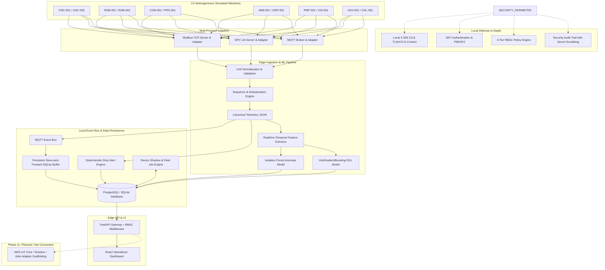
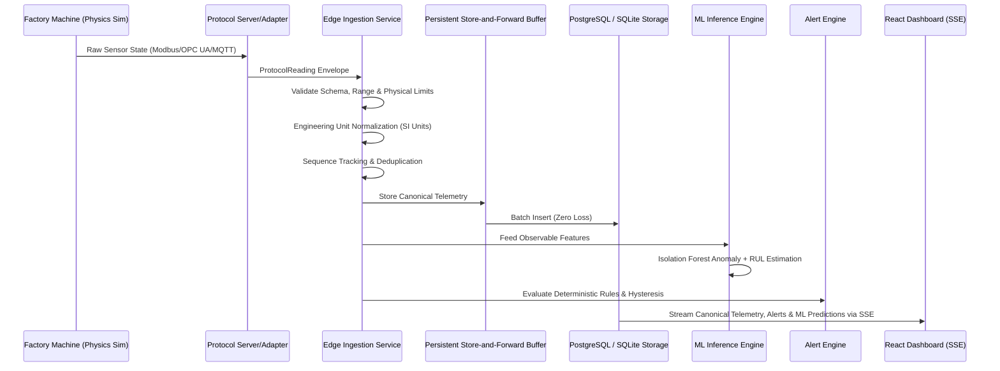
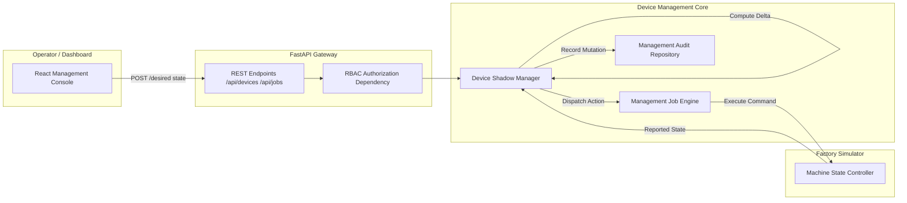
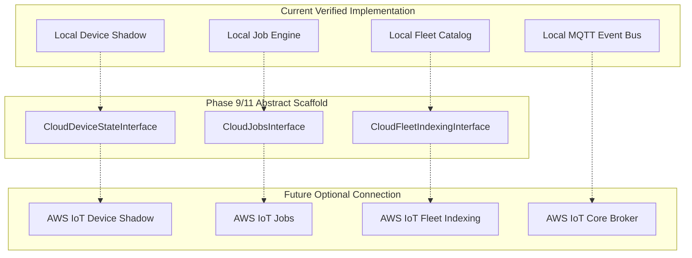

# Final System Architecture — Smart Factory Machine Monitoring & Predictive Maintenance

## 1. High-Level System Architecture

The Smart Factory system implements a **Local-First, Cloud-Optional Hybrid Architecture**. All operational capabilities—including multi-protocol simulation, edge ingestion, time-series storage, rule alerting, ML inference, Device Shadow digital twins, management jobs, and RBAC security—execute completely offline on local compute. An AWS-ready cloud interface layer is architected for future hybrid synchronization without creating active runtime dependencies.

---

## 2. Telemetry Ingestion Flow

---

## 3. Device Management & Digital Twin Flow

---

## 4. Security & Access Control Boundaries

- **Authentication**: Stateless Bearer JWT tokens signed with HMAC-SHA256 (`HS256`). Development accounts bootstrapped via environment configuration (`admin`, `operator`, `maintainer`, `viewer`).
- **Authorization**: Granular permissions mapped hierarchically:
  - `VIEWER`: Read-only access to telemetry, machine status, active alerts, and ML predictions.
  - `OPERATOR`: Viewer permissions + alert acknowledgement/resolution, command execution, and desired-state modifications.
  - `MAINTAINER`: Operator permissions + configuration job dispatch, OTA simulation, and fault scenario injection.
  - `ADMIN`: Full management access + security audit trail and certificate operations.
- **Secret Scrubbing**: Automatic regex and high-entropy string masking (`[REDACTED]`) across all error handlers and security audit logs.
- **Transport Security**: Local X.509 PKI certificate generation and mutual TLS (mTLS) enforcement with safe fallback (`TLS_ENABLED=false`).

---

## 5. Failure Injection & Resilience Boundaries

- **Store-and-Forward Buffering**: When the event bus or database storage is unavailable, telemetry is diverted to a local SQLite buffer table.
- **Deterministic Replay**: Upon reconnection, a background replay worker drains buffered records in sequence order, guaranteeing zero data loss and preventing duplicate persistence.
- **Circuit Isolation**: Failure in an individual machine protocol adapter (e.g. `PMP-001` MQTT disconnect) isolates the machine to `DEGRADED`/`OFFLINE` without impacting adjacent production lines.
- **Graceful ML Fallback**: If an ONNX runtime or model file is unavailable, the ML subsystem marks inference status as `DEGRADED` while raw telemetry ingestion and deterministic rule-based alerts continue uninterrupted.
- **Anti-Leakage Boundary**: Ground-truth degradation percentages and hidden failure timestamps are strictly prohibited from leaking into operational telemetry, REST APIs, or UI components.

---

## 6. AWS Future Integration Architecture (Phase 11 Scaffolding)

