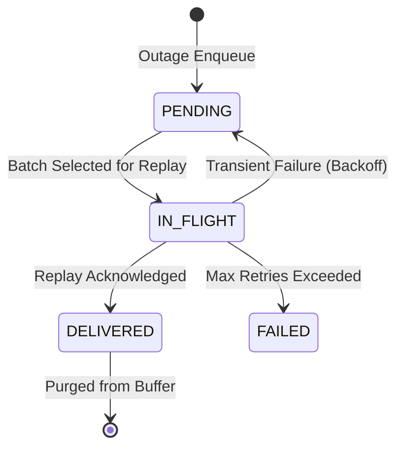

# Phase 4 — Store-and-Forward Persistent Buffer

## 1. Resilience Philosophy

In industrial edge architectures, temporary network interruptions and broker downtime are expected conditions. Phase 4 provides a local, disk-backed `PersistentBuffer` (using SQLite) that captures telemetry during transport outages and guarantees zero silent data loss.

## 2. Buffer Schema: `buffer_events`

```sql
CREATE TABLE buffer_events (
    event_id TEXT PRIMARY KEY,
    machine_id TEXT NOT NULL,
    sequence INTEGER NOT NULL,
    topic TEXT NOT NULL,
    payload TEXT NOT NULL,
    created_at REAL NOT NULL,
    retry_count INTEGER NOT NULL DEFAULT 0,
    next_retry_at REAL NOT NULL,
    status TEXT NOT NULL DEFAULT 'PENDING',
    last_error TEXT
);
CREATE INDEX ix_buffer_status_retry ON buffer_events(status, next_retry_at);
CREATE INDEX ix_buffer_machine_seq ON buffer_events(machine_id, sequence);
```

## 3. Buffer State Transitions



- **`PENDING`**: Event buffered on disk waiting for broker/storage recovery.
- **`IN_FLIGHT`**: Event currently being transmitted by the replay worker.
- **`DELIVERED`**: Event successfully persisted and confirmed; removed or archived.
- **`FAILED`**: Event exceeded maximum retry threshold (`max_retries = 10`).

## 4. Crash Durability

Because SQLite transactions are flushed to disk synchronously, pending events survive unexpected process crashes and power interruptions.
