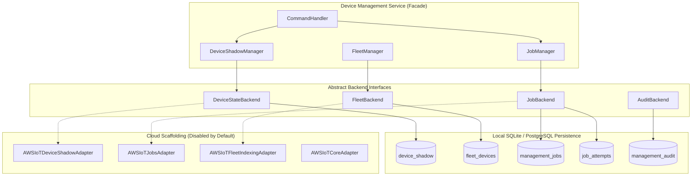

# Phase 9 Architecture — Local Device State, Fleet & Job Management

## 1. Overview & Architectural Principles

Phase 9 implements a **Local-First Device Management System** with clean abstract adapter interfaces designed for seamless future AWS IoT Core and hybrid cloud integration.

## 2. Core Separation Principles

1. **Protocol & Engine Agnosticism**: Downstream machine simulation and ingestion operate independently of configuration and management job workflows.
2. **Local-First Independence**: All Device Shadow state, fleet metadata indexing, job rollouts, retries, and audit history function 100% locally on SQLite and PostgreSQL.
3. **No Direct Cloud Coupling**: Domain entities and application services never import `boto3` or cloud client SDKs directly.
4. **Optimistic Concurrency & Audit Trails**: Every state change increments version tags and emits structured audit logs.
