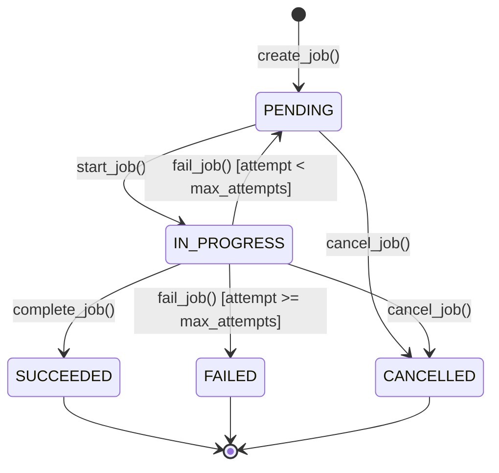

# Job Management & Execution Engine

## 1. Job Lifecycle & State Machine

## 2. Job Types

- `CONFIG_UPDATE`: Pushes desired configuration parameters to target machine shadow.
- `COMMAND`: Executes one-off administrative action.
- `OTA_SIMULATION`: Simulates staged firmware rollout and version bumping.
- `RESTART_SIMULATION`: Triggers controlled restart simulation.
- `SYNC_STATE`: Synchronizes reported state from desired state.

## 3. Retries & Attempt Logging

Each execution attempt generates a dedicated `JobAttemptRecord` in `job_attempts` storing start timestamp, completion timestamp, attempt number, status (`IN_PROGRESS`, `FAILED`, `SUCCEEDED`), and error details.
